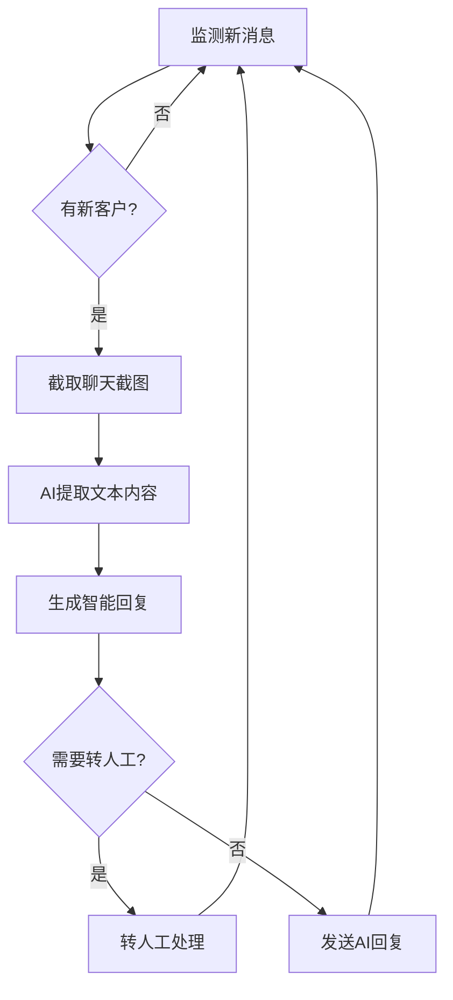

# Dify on QianNiu - 千牛智能客服机器人

[](https://www.python.org)
[](LICENSE)
[](https://github.com/tmwgsicp/dify-on-qianniu/actions)
[](https://dify.ai)
[](https://www.clicknium.com/)

基于 Dify AI 和 Clicknium 自动化的千牛客服机器人，通过 RPA 技术实现智能客服自动回复。

## 🎯 项目特点

- **界面自动化**：基于 Clicknium RPA 技术，直接操作千牛客服界面
- **多模态 AI**：支持文本和图像内容的智能处理
- **智能分流**：自动判断复杂问题并转人工处理
- **会话记忆**：基于客户ID的上下文记忆功能
- **轻量设计**：约400行Python代码，依赖简单

## 🚀 快速开始

### 环境要求

- Python 3.9+
- Windows 系统
- VScode（Clicknium 支持）
- 千牛客服工作台
- Dify AI 账号

### 安装步骤

1. **克隆项目**
```bash
git clone https://github.com/tmwgsicp/dify-on-qianniu.git
cd dify-on-qianniu
```

2. **安装依赖**
```bash
pip install -r requirements.txt
```

3. **配置文件**
```bash
cp config.example.json config.json
```

然后编辑 `config.json` 填入你的 API 配置。

4. **界面元素录制**

使用 Clicknium Studio 录制千牛客服界面的关键元素：
- 新消息提示区域
- 客户列表
- 聊天窗口
- 输入框和发送按钮
- 转人工按钮
## 🔧 界面录制指南

使用 Clicknium Studio 录制以下界面元素：

| 元素名称 | 用途 | 录制建议 |
|---------|------|---------|
| `button_send` | 发送按钮 | 选择发送按钮 |
| `button_send` | 发送按钮 | 选择发送按钮 |
| `new_message` | 检测新消息 | 选择消息提示红点 |
| `customer_list` | 客户列表 | 选择客户名称区域 |
| `chat_window` | 聊天窗口 | 选择完整对话区域 |
| `input_box` | 输入框 | 选择文本输入区域 |
| `transfer_button` | 转人工按钮 | 选择转人工功能 |
| `reply_text` | 消息回复区域 | 选择转人工功能 |

5. **运行程序**
```bash
python qianniu_bot.py
```

## ⚙️ 配置说明

### Dify AI 配置

需要在 Dify 中创建两个应用：

1. **对话型应用**：用于智能客服回复
2. **工作流应用**：用于图像内容识别

### 配置文件示例

```json
{
    "dify": {
        "vision_api_url": "https://api.dify.ai/v1/workflows/run",
        "chat_api_url": "https://api.dify.ai/v1/chat-messages",
        "file_upload_url": "https://api.dify.ai/v1/files/upload",
        "api_key": "app-your-chat-api-key",
        "vision_api_key": "app-your-vision-api-key"
    },
    "clicknium": {
        "license_key": "your-clicknium-license-key"
    },
    "settings": {
        "check_interval": 2,
        "use_screenshot": true,
        "cleanup_screenshots": true
    }
}
```

## 🔧 工作原理



## 📁 项目结构

```
dify-on-qianniu/
├── qianniu_bot.py          # 主程序文件
├── config.json            # 配置文件
├── config.example.json    # 配置文件模板
├── requirements.txt       # Python依赖
├── .locator/              # Clicknium界面定位器
├── screenshots/           # 聊天截图缓存
└── README.md              # 项目说明
```

## 🎯 核心功能

### 1. 智能消息监测
- 实时监测千牛客服界面的新消息
- 基于界面元素变化判断新客户到达

### 2. 多模态内容处理
- 自动截取聊天记录
- AI提取图像中的文本信息
- 支持文本和图片混合内容

### 3. 智能回复生成
- 基于 Dify AI 的专业客服回复
- 上下文记忆，支持多轮对话
- 自动判断复杂问题转人工

### 4. 界面自动化操作
- 自动点击和输入
- 发送回复消息
- 一键转人工处理

## 🛠️ 故障排除

### 常见问题

1. **界面识别失败**
   - 重新录制界面元素
   - 检查千牛客服界面是否有更新

2. **API 调用失败**
   - 检查网络连接
   - 验证 Dify API 密钥是否正确

3. **截图功能异常**
   - 确认系统显示设置
   - 检查权限设置

4. **程序启动失败**
   - 检查 Clicknium 许可证
   - 确认配置文件格式正确

### 调试模式

在代码开头添加调试日志：

```python
import logging
logging.basicConfig(level=logging.DEBUG)
```

## 🚀 扩展开发

### 平台适配

理论上可以适配其他客服平台：
- 京东客服
- 拼多多客服
- 其他客服系统

只需重新录制对应平台的界面元素即可。

### 功能扩展

- 添加更多 AI 模型支持
- 集成知识库功能
- 添加客服数据统计
- 支持更多消息类型

## 📄 许可证

本项目采用 MIT 许可证，详见 [LICENSE](LICENSE) 文件。

## ⚠️ 免责声明

- 本项目仅供学习和研究使用
- 使用时请遵守相关平台的服务条款
- 建议在测试环境充分验证后再用于生产

## 🤝 贡献

欢迎提交 Issue 和 Pull Request！

## 👨‍💻 开发者

本项目由 [@tmwgsicp](https://github.com/tmwgsicp) 开发和维护。

## 📞 联系方式

如有问题或建议，请通过 GitHub Issues 联系。

---

**⭐ 如果这个项目对你有帮助，请给个Star支持一下！** 