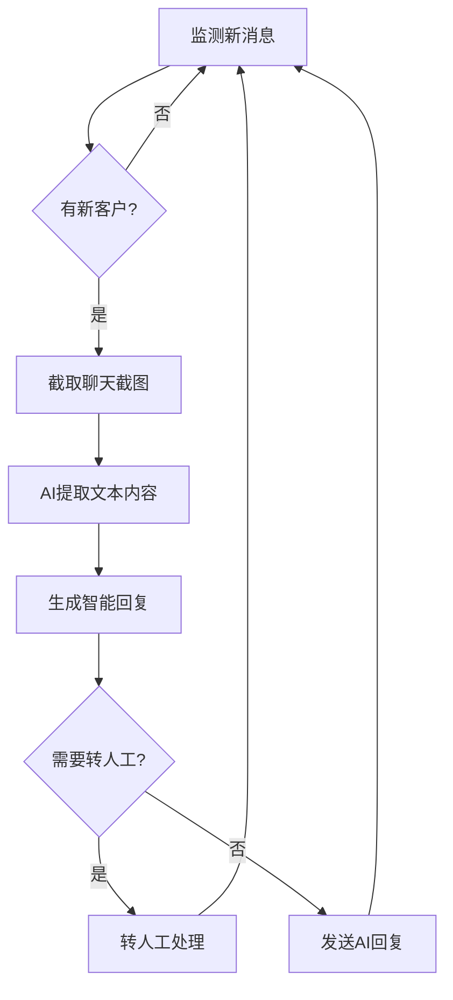
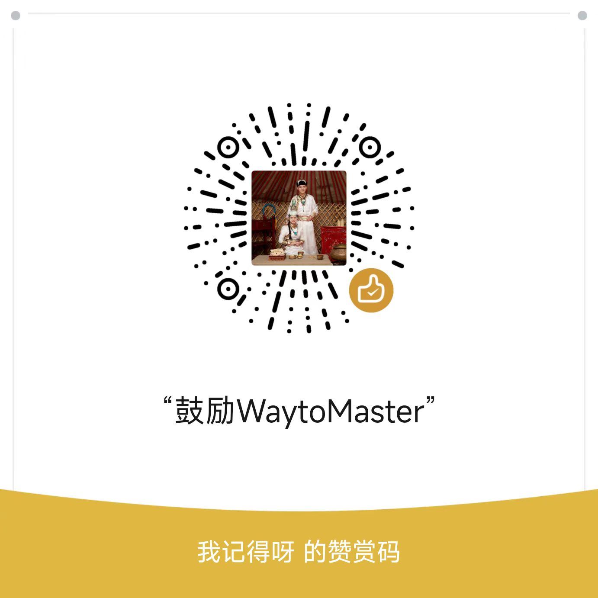

# Dify-on-Qianniu - 千牛智能客服机器人

[](https://www.python.org)
[](LICENSE)
[](https://dify.ai)
[](https://www.clicknium.com/)

基于Clicknium和Dify的轻量千牛智能客服机器人，支持扩展到京东、拼多多、抖音等电商平台

## 🎯 项目特点

- **界面自动化**：基于Clicknium，直接操作千牛客户端
- **高度定制**：后端AI基于Dify，智能客服逻辑支持定制化
- **轻量设计**：约400行Python代码，依赖简单
- **智能分流**：自动判断复杂问题并转人工处理

## 🚀 快速开始

### 环境要求

- Python 3.9+
- Windows 系统
- Clicknium许可
- VScode（Clicknium支持）
- 千牛客户端
- Dify平台（建议私有化部署）

### 安装步骤

1. **克隆项目**
```bash
git clone https://github.com/tmwgsicp/dify-on-qianniu.git
cd dify-on-qianniu
```

2. **安装依赖**
```bash
pip install -r requirements.txt
```

3. **配置文件**
```bash
cp config.example.json config.json
```

然后编辑 `config.json` 填入你的 API 配置。

4. **千牛客户端设置**

⚠️ **重要设置**：在千牛客户端进行以下配置，否则机器人可能无法正常工作：

1. 打开千牛客户端
2. 进入 **系统设置** → **接待设置**
3. **勾选**：`关闭客服工作台是否清除正在接待列表已读会话`

> 此设置确保机器人重启后能够继续处理之前的会话，避免丢失客户对话。

5. **界面元素录制**

使用 Clicknium Studio 录制千牛客服界面的关键元素：
- 新消息提示区域
- 客户列表
- 聊天窗口
- 输入框和发送按钮
- 转人工按钮

## 🔧 界面录制指南

使用 Clicknium Studio 录制以下界面元素：

| 元素名称 | 用途 | 录制建议 |
|---------|------|---------|
| `new_message` | 检测新消息 | 录制正在接待内的消息提醒 |
| `current_user` | 获取客户名称 | 录制客户名称区域 |
| `chat_window` | 聊天窗口 | 录制完整聊天内容区域 |
| `reply_text` | 消息回复区域 | 录制消息回复区域 |
| `button_send` | 发送按钮 | 录制发送按钮 |
| `button_接待关闭` | 关闭接待中心 | 录制接待中心右上角的关闭按钮 |
| `button_跳转接待中心` | 从工作台跳转接待中心 | 录制工作台界面右上角的旺旺图标 |
| `button_transfer` | 转人工按钮 | 录制接待中心的转人工按钮 |

6. **运行程序**
```bash
python qianniu_bot.py
```

## ⚙️ 配置说明

### Dify AI 配置

需要在 Dify 中创建两个应用：

1. **对话型应用**：用于智能客服回复，智能客服处理逻辑需自行搭建
2. **工作流应用**：用于图像内容识别，获取千牛客户端内客户对话内容

### 配置文件示例

```json
{
    "dify": {
        "vision_api_url": "https://api.dify.ai/v1/workflows/run",
        "chat_api_url": "https://api.dify.ai/v1/chat-messages",
        "file_upload_url": "https://api.dify.ai/v1/files/upload",
        "api_key": "app-your-chat-api-key",
        "vision_api_key": "app-your-vision-api-key"
    },
    "clicknium": {
        "license_key": "your-clicknium-license-key"
    },
    "settings": {
        "check_interval": 2,
        "use_screenshot": true,
        "cleanup_screenshots": true
    }
}
```

## 🔧 工作原理



## 📁 项目结构

```
dify-on-qianniu/
├── qianniu_bot.py         # 主程序文件
├── config.example.json    # 配置文件模板
├── requirements.txt       # Python依赖
├── .locator/              # Clicknium界面定位器
├── screenshots/           # 聊天截图缓存
└── README.md              # 项目说明
```

## 🛠️ 故障排除

### 常见问题

1. **机器人无法检测到新消息**
   - 检查千牛客户端设置：**系统设置** → **接待设置** → 勾选 `关闭客服工作台是否清除正在接待列表已读会话`
   - 重新录制消息提示区域的界面元素

2. **界面识别失败**
   - 重新录制界面元素
   - 检查千牛客服界面是否有更新
   - 确认千牛客户端版本兼容性

3. **API 调用失败**
   - 检查网络连接
   - 验证 Dify API 密钥是否正确
   - 确认 Dify 应用配置正确

4. **截图功能异常**
   - 确认系统显示设置
   - 检查权限设置
   - 验证截图保存路径是否正确

5. **程序启动失败**
   - 检查 Clicknium 许可证
   - 确认配置文件格式正确
   - 验证 Python 版本是否为 3.9+


## 🚀 扩展开发

### 平台适配

理论上可以适配其他电商客服平台：
- 京东
- 拼多多
- 抖音
- 其他电商客服

核心处理逻辑已实现，只需重新录制对应平台的界面元素即可。

## 📄 许可证

本项目采用 MIT 许可证，详见 [LICENSE](LICENSE) 文件。

## ⚠️ 免责声明

- 本项目仅供学习和研究使用
- 使用时请遵守相关平台的服务条款
- 建议在测试环境充分验证后再用于生产

## 🤝 贡献

欢迎提交 Issue 和 Pull Request！

## 📞 联系与交流

### 💬 技术交流与学习指导

如果你在部署过程中遇到问题，或者想要学习更多关于AI自动化、AI工作流的技术，欢迎添加我的联系方式进行交流：

<div align="center">
  
  <p><em>扫码添加联系方式，获取技术支持和学习指导</em></p>
</div>

### 🎯 问题反馈

对于一般性问题和Bug报告，请优先通过 [GitHub Issues](https://github.com/tmwgsicp/dify-on-qianniu/issues) 提交，这样可以帮助更多用户。

## ☕ 支持项目

如果这个项目对你有帮助，欢迎请我喝杯奶茶！你的支持是我持续更新和维护项目的动力。

<div align="center">
  
  <p><em>感谢你的支持与鼓励！</em></p>
</div>

### 🙏 其他支持方式

- ⭐ 给项目一个 Star
- 🐛 提交 Bug 报告和改进建议  
- 📢 向朋友推荐这个项目
- 🔧 贡献代码和文档

---

**⭐ 如果这个项目对你有帮助或启发，请给个Star支持一下！** 